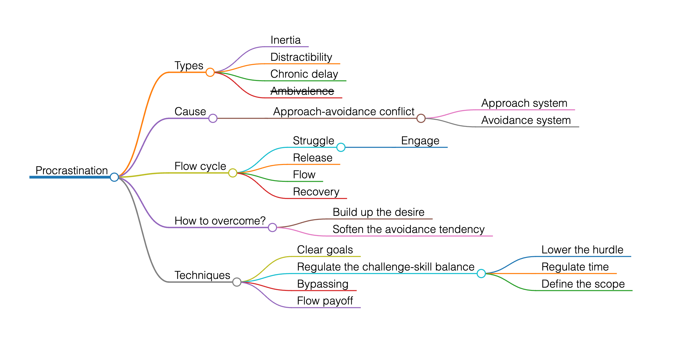

# Procrastination

This is based on https://youtu.be/EkDxsQRbIwo

> Procrastination is the act of unnecessarily and voluntarily delaying or postponing something despite knowing that there will be negative consequences for doing so

-- https://en.wikipedia.org/wiki/Procrastination

## Types

### Inertia

Prevents you form starting the task

### Distractibility

Diverts your focus mid-task

### Chronic delay

Perpetually postpones and prevents progress

### ~~Ambivalence~~

It may not be procrastination, it may be a signal for real danger from the amygdala

Maybe not aligned with your values, goals, intrinsic motivators (sense of purpose, autonomy and mastery), maybe you burned out

## Cause

High motivation and inaction at teh same time

### Approach-avoidance conflict

When closer to the task, avoidance tendency increases
When away form the task, approach tendency increases

#### Approach system

Associated with dopamine rich areas, like [striatum](https://en.wikipedia.org/wiki/Striatum)) and [ventral tegmental area (VTA)](https://en.wikipedia.org/wiki/Ventral_tegmental_area)

Linked to pleasure and reward-encouraged actions

#### Avoidance system

Associated with cortisol rich areas of the brain, like the amygdala and hippocampus

Linked to fear and anxiety, which encourage inaction

You experience both feelings at the same time

## Flow cycle

### Struggle

You fight for the task to absorb you

Frustration, anxiety, discomfort

like Warm up in sport

#### Engage

Has a first phase of engaging

### Release

Task persistence

Pain relief of endorphins rush through the system

### Flow

Effortless attention
Serotonin and dopamine drives you forward

### Recovery

Replenish the costly neurochemistry

## How to overcome?

### Build up the desire

### Soften the avoidance tendency

## Techniques

### Clear goals

Not outcome focused but output focused

Relies on basal ganglia that executes familiar habits

Split into tiny tasks to keep the bite-sized dopamine hits

Make teh first actions so easy that there is nothing left for the brain to resist

### Regulate the challenge-skill balance

Balance between perceived level of challenge and perceived level of skill

If challenge is high, you are overwhelmed

If challenge is low, you are bored

The challenge should be slightly ahead of teh skill

#### Lower the hurdle

Restructure things to engage with less efforts

#### Regulate time

Give less time to boring tasks (tax returns)

Give more time to challenging tasks (learning new skills)

#### Define the scope

When uncertainty is overwhelming, it tilts the challenge-skill balance

Take a bit of a time to figure out the true scope of the work

Define what needs to be done and why it needs to be done
That boosts your motivation

### Bypassing

Jump into the task before the amygdala takes over

Helps to do first thing after wake up

### Flow payoff

Avoid getting out of the flow easily - eliminate distractors

Crossing between activities breaks the flow
